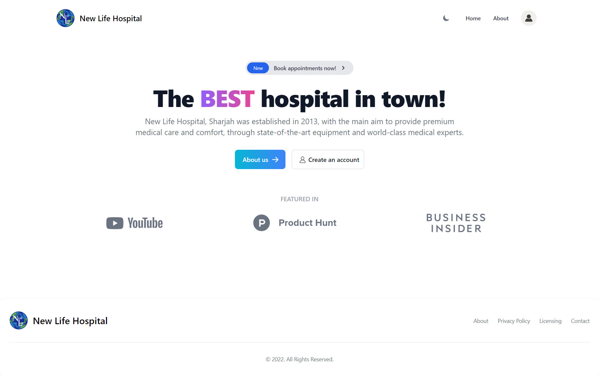
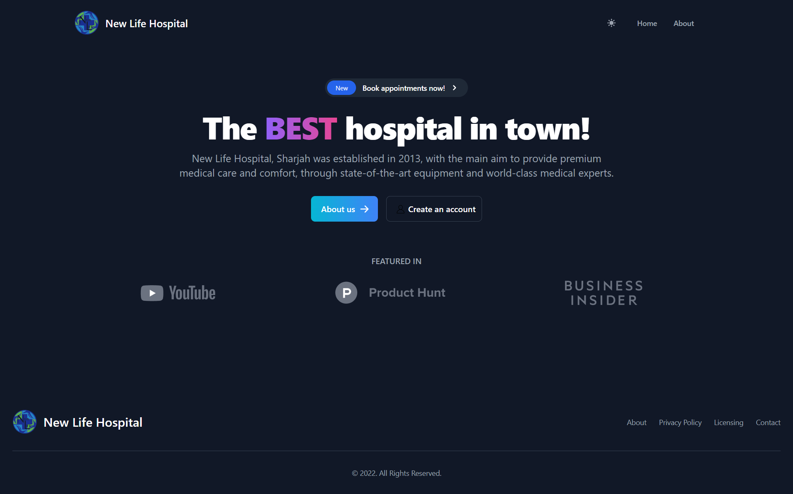
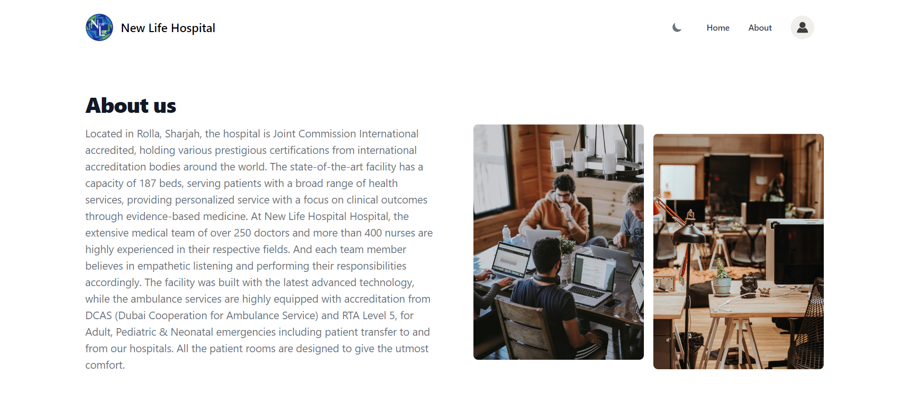
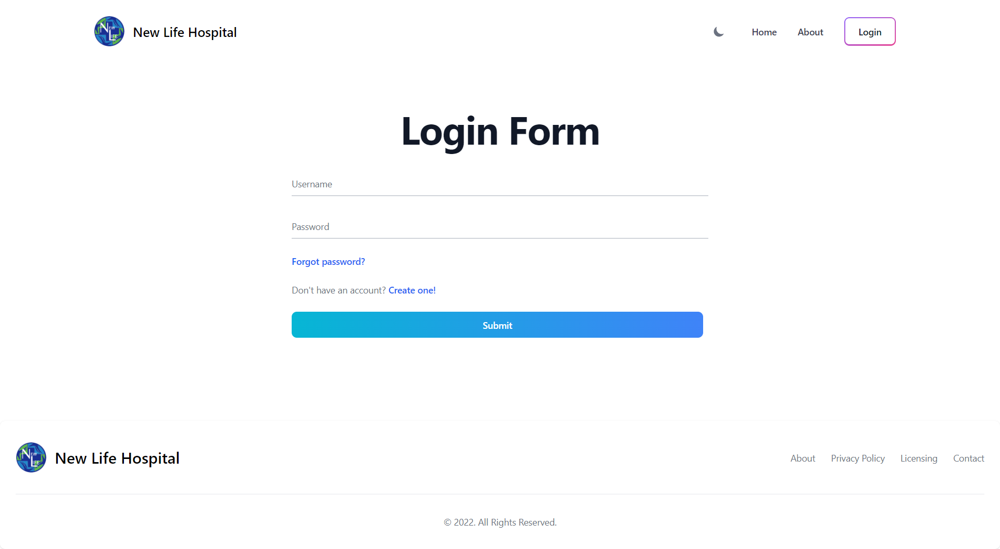
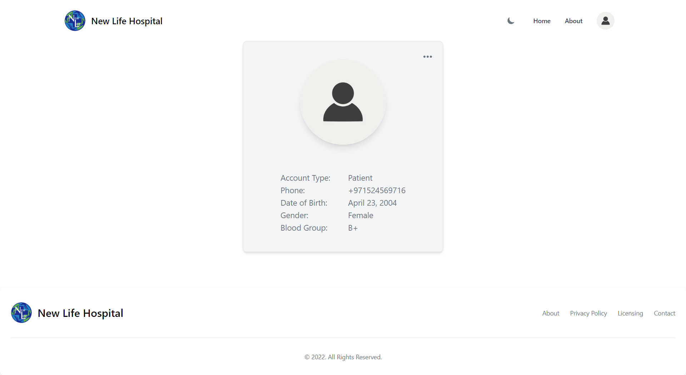
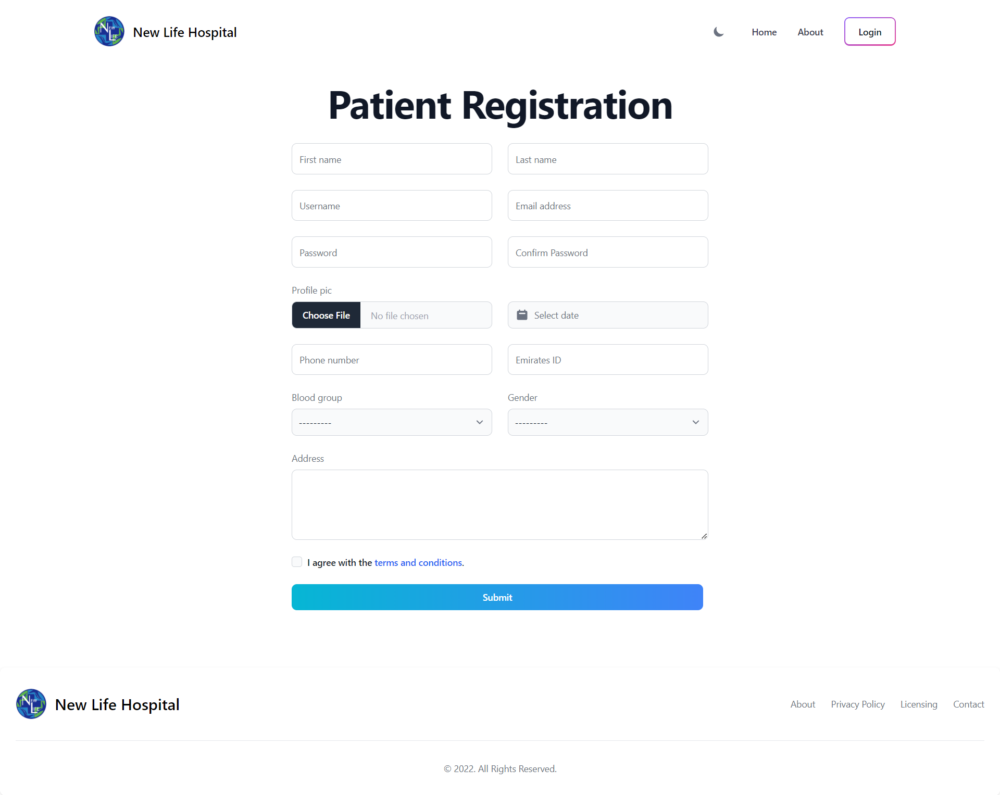
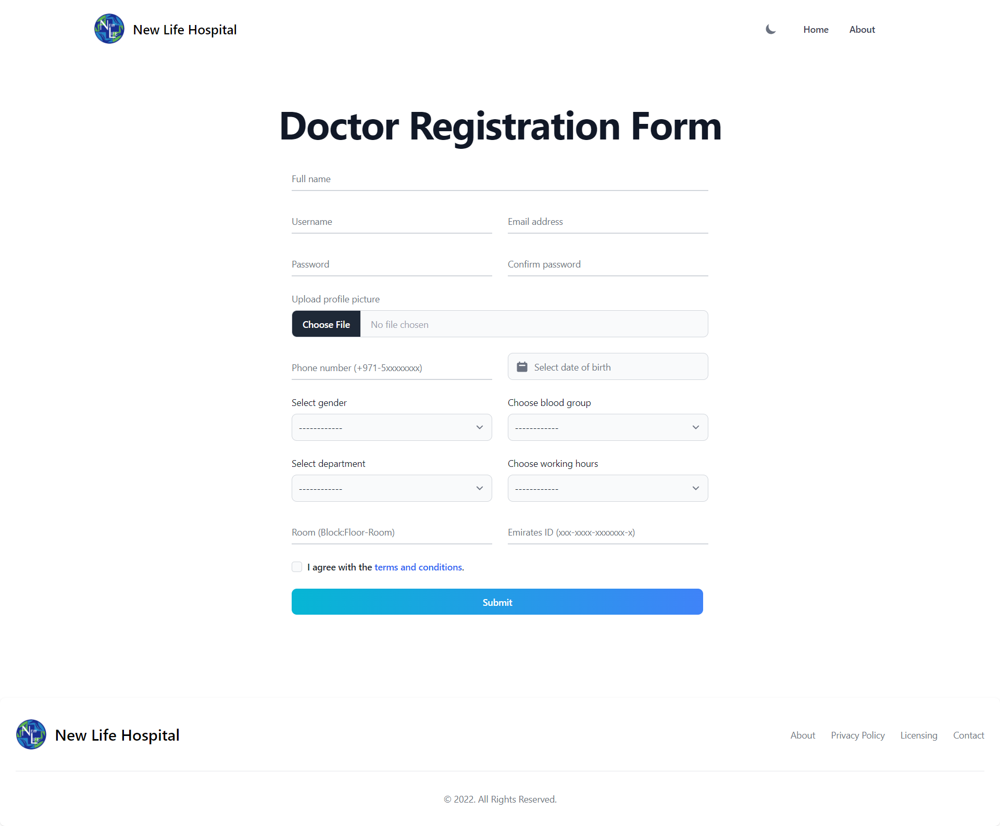
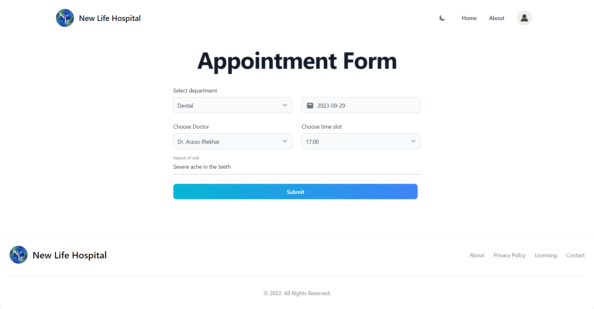
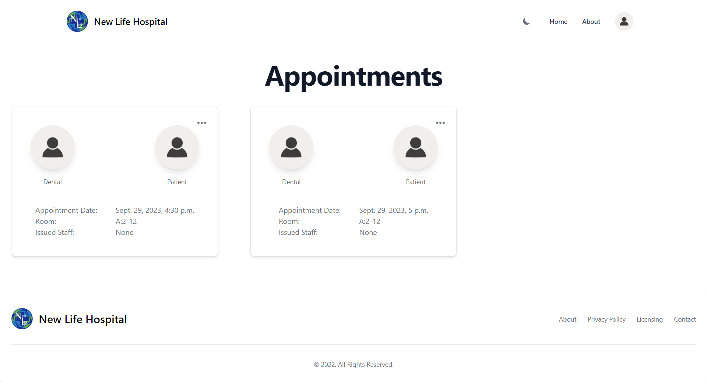

# New Life Hospital Management System

## Overview
The Hospital Management System is a web-based application developed using Django, designed to streamline and manage various aspects of a hospital or healthcare facility. This system allows hospital staff to efficiently manage patient records, doctor appointments, medical records, and more.

## Features
- **Patient Management**: Add and manage patient records, including personal information and medical history.

- **Doctor Management**: Maintain a database of doctors, including their specialization and contact details.

- **Appointment Booking**: Schedule and manage patient appointments with available doctors.

- **Medical Record Management**: Keep track of medical records, including prescriptions, diagnosis, and treatment history.

## Installation
To set up and run the Hospital Management System, follow these steps:

1. Clone this repository to your local machine:
    ```bash
    git clone https://github.com/nihaalnz/New-Life-Hospital-System
    ```
2. Navigate to project directory:
    ```bash
    cd New-Life-Hospital-System
    ```
3. Create and activate a virtual environment (recommended):
    ```bash
    python -m venv venv
    source venv/bin/activate
    ```
4. Install the required Python packages:
    ```bash
    pip install -r requirements.txt
    ```
5. Apply database migrations:
    ```bash
    cd new_life
    python manage.py migrate
    ```
6. Create a superuser account to access the admin panel:
    ```bash
    python manage.py createsuperuser
    ```
7. Install tailwind to build css (new terminal)

    7.1 Navigate to the tailwind app:
        
    ```bash
    cd new_life/tailwind_base/static_src
    ```
    7.2 Install tailwind and other dependencies:
    ```bash
    npm install
    ```
    7.3 Build the css using tailwindcss and continue looking for changes:
    ```bash
    npm run dev
    ```

8. Start the development server:
    ```bash
    python manage.py runserver
    ```
9. Access the application in your web browser at http://localhost:8000.

## Usage
### Admin Panel
- Access the admin panel at http://localhost:8000/admin using the superuser credentials created earlier. Here, you can manage patients, doctors, appointments, and medical records.

### Population Script
- To populate the database with test data from [data.json](/data.json) run the following command:
    ```bash
    python script.py
    ```
- Now test data is filled on the database with user password as "asdasd" which can be used to log in to the website and book appointments.

## UI
### Landing page


### Landing (dark)


### About page


### Login page


### Patient details page


### Register patient page


### Register doctor page


### Appointment page


### Appointment list page


## Contributing
Contributions to this project are welcome! If you find a bug or have an enhancement in mind, please open an issue or create a pull request.

## License
This project is licensed under the MIT License. See the [LICENSE](/LICENSE) file for details.
